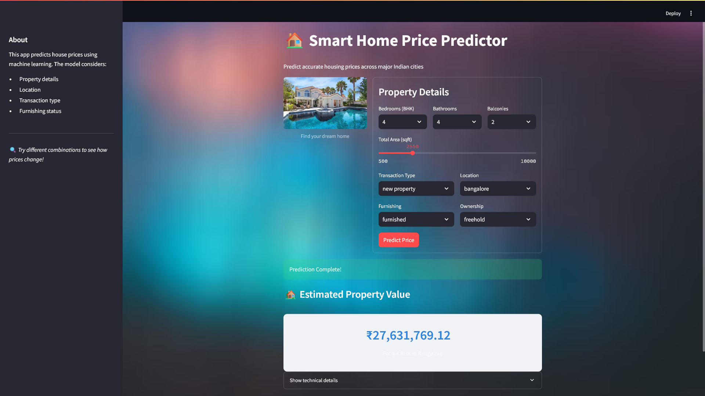

# 🏠 House Price Prediction App

A machine learning-powered web application built with Streamlit to predict house prices across major Indian cities.



---

## Features
- **Accurate Predictions**: Trained Random Forest Regression model for estimating housing prices.
- **Interactive UI**: Clean, user-friendly Streamlit interface to input property details like BHK, location, area, etc.
- **Quick Deployment**: Uses `.pkl` model files for fast and easy startup.

---
## Installation
1. Clone the repository and enter its directory.  
2. (Optional) Create and activate a virtual environment.  
3. Install required Python packages:  
   ```bash
   pip install -r requirements.txt